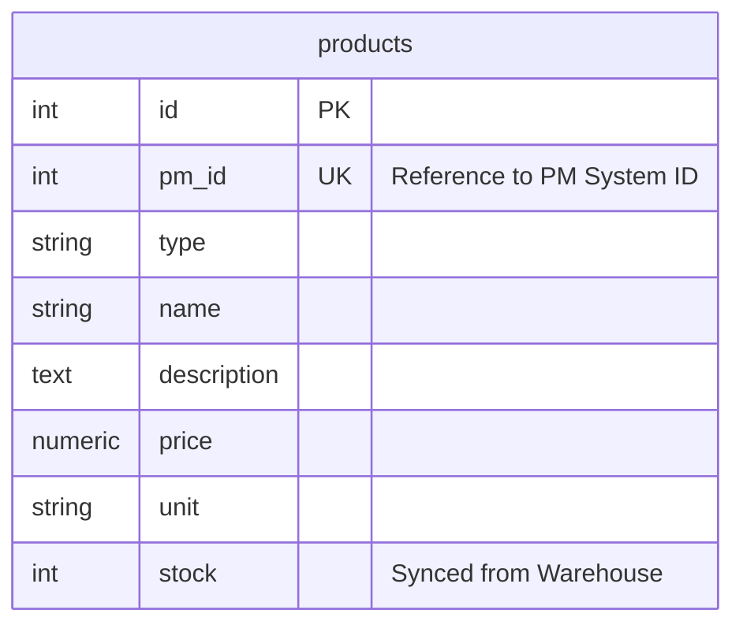
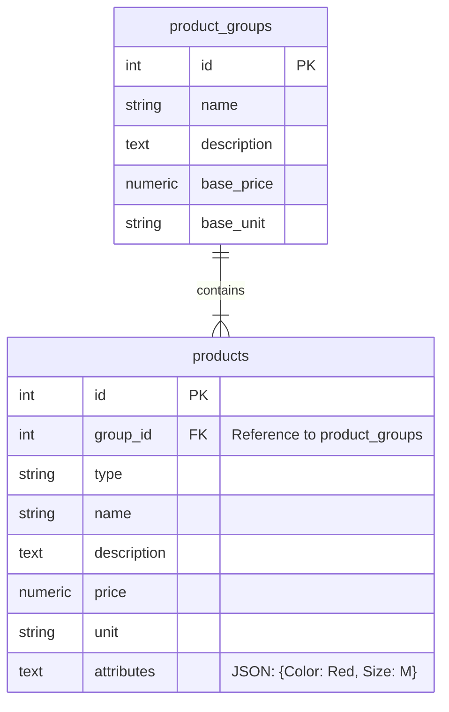
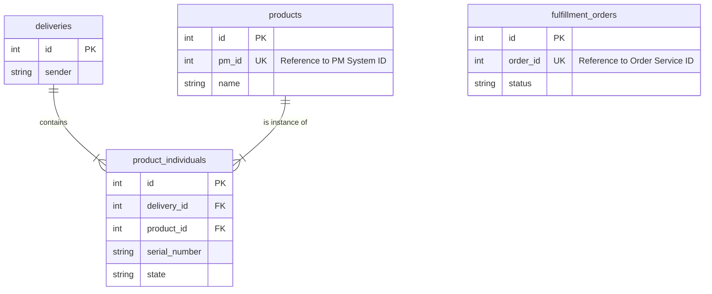
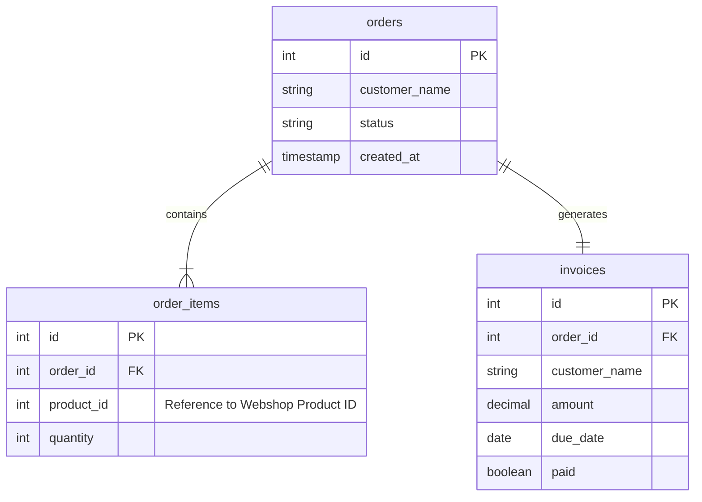

# Database Schema Documentation

This document visualizes the database schemas for the four microservices in our landscape.

## 1. Webshop System (PostgreSQL)
The Webshop database stores product information synced from the PM system and local stock levels.

## 2. Product Management System (PostgreSQL)
The PM database is the source of truth for product information and handles product variations.

## 3. Warehouse Service (PostgreSQL)
The Warehouse database manages physical inventory, deliveries, and fulfillment.

## 4. Order Service (PostgreSQL)
The Order Service database manages customer orders and invoicing.

